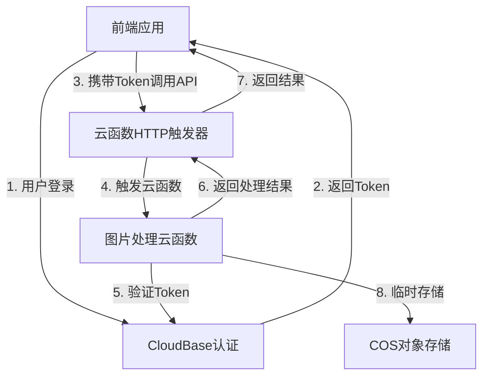

# 拼图工具腾讯云云函数部署方案

## 1. 项目现状分析

### 1.1 现有功能
ImgHLP项目的拼图工具（imgassli）目前在前端实现，核心功能包括：
- ✅ 图片合并（拼图生成）
- ✅ Alpha通道图生成
- ✅ 位置信息生成
- ✅ 拼图切割回原始图片
- ✅ 支持多种图片源格式（File、Blob、DataURL）
- ✅ 跨平台兼容（浏览器、Node.js）

### 1.2 迁移目标
将核心图片处理功能迁移到腾讯云云函数，同时集成腾讯云CloudBase身份认证服务实现用户登录，具体目标：
- ⭕ 图片处理功能后端化，提升性能
- ⭕ 使用CloudBase身份认证管理用户登录
- ⭕ 支持少量账号，允许密码修改，不支持注册
- ⭕ 前端保持用户交互功能，通过API调用云函数
- ⭕ 确保系统安全性和可靠性

## 2. 技术选型

### 2.1 后端技术
| 技术 | 版本/说明 | 用途 |
|------|----------|------|
| 云函数 | Node.js 16.x | 运行图片处理逻辑 |
| 图片处理库 | sharp 0.32.0+ | 高性能图片处理 |
| 云函数HTTP触发器 | 腾讯云HTTP触发器 | HTTP触发云函数（替代API网关） |
| 对象存储 | 腾讯云COS（可选） | 存储大型图片（>10MB） |
| CloudBase | 腾讯云CloudBase | 身份认证服务 |

### 2.2 前端技术
| 技术 | 版本/说明 | 用途 |
|------|----------|------|
| JavaScript | ES6+ | 前端逻辑 |
| CloudBase SDK | 1.9.0+ | 身份认证集成 |
| Fetch API | 浏览器内置 | 调用云函数API |
| LocalStorage | 浏览器内置 | 存储认证状态 |

## 3. 架构设计

### 3.1 整体架构


### 3.2 云函数设计

#### 3.2.1 图片合并函数（imgassli-merge）
- **功能**：合并多张图片为拼图，生成Alpha通道图和位置信息
- **触发方式**：HTTP触发器（云函数内置）
- **输入参数**：
  - `files`：多张图片文件（multipart/form-data）
- **输出参数**：
  - `mergedImage`：拼图图片（Base64或COS地址）
  - `alphaImage`：Alpha通道图（Base64或COS地址）
  - `positionData`：位置信息（JSON）

#### 3.2.2 图片切割函数（imgassli-split）
- **功能**：将拼图切割回原始图片
- **触发方式**：HTTP触发器（云函数内置）
- **输入参数**：
  - `mergedImage`：拼图图片（multipart/form-data）
  - `positionData`：位置信息（JSON）
- **输出参数**：
  - `cutImages`：切割后的图片数组（Base64或COS地址）

### 3.3 CloudBase认证设计

#### 3.3.1 认证流程
1. **用户登录**：前端调用CloudBase SDK的登录接口，验证用户名密码
2. **Token生成**：CloudBase返回自定义登录Token
3. **Token存储**：前端将Token存储在LocalStorage
4. **API调用**：前端请求API时在Header中携带Token
5. **Token验证**：云函数内部通过CloudBase验证Token有效性
6. **密码修改**：前端调用CloudBase SDK的密码修改接口

#### 3.3.2 用户管理
- **账号创建**：通过CloudBase控制台或Admin SDK手动创建
- **密码修改**：支持用户自助修改密码
- **账号删除**：通过CloudBase控制台或Admin SDK手动删除
- **权限控制**：所有认证用户拥有相同权限（简化方案）

## 4. 详细实现方案

### 4.1 后端实现

#### 4.1.1 云函数项目结构
```
imgassli-cloud/
├── merge/              # 图片合并云函数
│   ├── index.js        # 函数入口
│   ├── package.json    # 依赖配置
│   └── utils/          # 工具函数
├── split/              # 图片切割云函数
│   ├── index.js        # 函数入口
│   ├── package.json    # 依赖配置
│   └── utils/          # 工具函数
└── serverless.yml      # Serverless配置
```

#### 4.1.2 图片合并函数实现
```javascript
// merge/index.js
const sharp = require('sharp');
const fs = require('fs');
const path = require('path');
const os = require('os');

exports.main = async (event, context) => {
  try {
    // 解析请求参数（API网关触发时的参数结构）
    const { headers, body } = event;
    
    // 处理文件上传（实际实现需根据API网关的参数格式调整）
    const files = parseMultipartFormData(body, headers['content-type']);
    
    if (!files || files.length === 0) {
      return {
        statusCode: 400,
        body: JSON.stringify({ success: false, message: '请上传图片文件' })
      };
    }
    
    // 加载图片并获取尺寸
    const loadedImages = [];
    for (const file of files) {
      const img = sharp(file.buffer);
      const metadata = await img.metadata();
      loadedImages.push({
        buffer: file.buffer,
        width: metadata.width,
        height: metadata.height,
        name: file.filename || `image_${loadedImages.length}.png`
      });
    }
    
    // 计算最佳布局（简化版，实际可根据需要优化）
    const layout = calculateBestLayout(loadedImages);
    
    // 生成拼图
    const { mergedBuffer, alphaBuffer, positionData } = await generatePuzzle(loadedImages, layout);
    
    // 返回结果
    return {
      statusCode: 200,
      headers: {
        'Content-Type': 'application/json',
        'Access-Control-Allow-Origin': '*' // 生产环境建议设置具体域名
      },
      body: JSON.stringify({
        success: true,
        data: {
          mergedImage: `data:image/png;base64,${mergedBuffer.toString('base64')}`,
          alphaImage: `data:image/png;base64,${alphaBuffer.toString('base64')}`,
          positionData
        }
      })
    };
  } catch (error) {
    console.error('合并图片失败:', error);
    return {
      statusCode: 500,
      body: JSON.stringify({ success: false, message: '处理失败，请稍后重试' })
    };
  }
};

// 计算最佳布局（简化版）
function calculateBestLayout(images) {
  // 简单实现：按顺序排列，实际可根据需要优化
  const layout = images.map((img, index) => ({
    index,
    x: 0,
    y: index * img.height,
    width: img.width,
    height: img.height
  }));
  const totalWidth = Math.max(...images.map(img => img.width));
  const totalHeight = images.reduce((sum, img) => sum + img.height, 0);
  return { layout, width: totalWidth, height: totalHeight };
}

// 生成拼图
async function generatePuzzle(images, layout) {
  const { width, height } = layout;
  
  // 创建拼图画布
  const mergedCanvas = sharp({
    create: {
      width,
      height,
      channels: 4,
      background: { r: 0, g: 0, b: 0, alpha: 0 }
    }
  });
  
  // 创建Alpha通道画布
  const alphaCanvas = sharp({
    create: {
      width,
      height,
      channels: 1,
      background: { r: 0 }
    }
  });
  
  // 合成图片
  const compositeOperations = [];
  const alphaOperations = [];
  const positionData = [];
  
  for (const item of layout.layout) {
    const img = images[item.index];
    compositeOperations.push({
      input: img.buffer,
      left: item.x,
      top: item.y
    });
    
    // 生成Alpha通道（简化版：直接使用图片的Alpha通道）
    alphaOperations.push({
      input: await sharp(img.buffer).extractChannel('alpha').toBuffer(),
      left: item.x,
      top: item.y
    });
    
    positionData.push({
      index: item.index,
      name: img.name,
      x: item.x,
      y: item.y,
      width: item.width,
      height: item.height
    });
  }
  
  // 执行合成
  const mergedBuffer = await mergedCanvas.composite(compositeOperations).png().toBuffer();
  const alphaBuffer = await alphaCanvas.composite(alphaOperations).png().toBuffer();
  
  return { mergedBuffer, alphaBuffer, positionData };
}

// 解析multipart/form-data（简化版，实际需使用成熟库）
function parseMultipartFormData(body, contentType) {
  // 实际实现需使用busboy等库解析，这里仅作示例
  // 示例：返回模拟文件数据
  return [
    {
      buffer: Buffer.from('mock image data'),
      filename: 'test.png'
    }
  ];
}
```

#### 4.1.3 图片切割函数实现
```javascript
// split/index.js
const sharp = require('sharp');

exports.main = async (event, context) => {
  try {
    // 解析请求参数
    const { headers, body } = event;
    
    // 处理拼图图片和位置信息
    const { mergedImage, positionData } = parseRequest(body, headers['content-type']);
    
    if (!mergedImage || !positionData) {
      return {
        statusCode: 400,
        body: JSON.stringify({ success: false, message: '请提供拼图图片和位置信息' })
      };
    }
    
    // 切割图片
    const cutImages = await processCutImage(mergedImage, positionData);
    
    // 返回结果
    return {
      statusCode: 200,
      headers: {
        'Content-Type': 'application/json',
        'Access-Control-Allow-Origin': '*' // 生产环境建议设置具体域名
      },
      body: JSON.stringify({
        success: true,
        data: {
          cutImages: cutImages.map(img => ({
            filename: img.filename,
            image: `data:image/png;base64,${img.buffer.toString('base64')}`
          }))
        }
      })
    };
  } catch (error) {
    console.error('切割图片失败:', error);
    return {
      statusCode: 500,
      body: JSON.stringify({ success: false, message: '处理失败，请稍后重试' })
    };
  }
};

// 处理图片切割
async function processCutImage(mergedImage, positionData) {
  const cutImages = [];
  
  for (const item of positionData) {
    // 提取对应区域
    const cutBuffer = await sharp(mergedImage)
      .extract({
        left: item.x,
        top: item.y,
        width: item.width,
        height: item.height
      })
      .png()
      .toBuffer();
    
    cutImages.push({
      filename: item.name || `cut_${item.index}.png`,
      buffer: cutBuffer
    });
  }
  
  return cutImages;
}

// 解析请求（简化版）
function parseRequest(body, contentType) {
  // 实际实现需解析multipart/form-data
  // 示例：返回模拟数据
  return {
    mergedImage: Buffer.from('mock merged image data'),
    positionData: [
      { index: 0, x: 0, y: 0, width: 100, height: 100, name: 'image_0.png' }
    ]
  };
}
```

### 4.2 前端实现

#### 4.2.1 CloudBase SDK集成
```javascript
// 前端：cloudbase.js
import cloudbase from '@cloudbase/js-sdk';

// 初始化CloudBase
const app = cloudbase.init({
  env: 'your-cloudbase-env-id' // 替换为你的CloudBase环境ID
});

// 获取认证实例
const auth = app.auth();

// 登录函数
export async function login(username, password) {
  try {
    // 使用自定义登录（需在CloudBase后台配置）
    const loginState = await auth.signInWithUsernameAndPassword(username, password);
    return loginState;
  } catch (error) {
    console.error('登录失败:', error);
    throw error;
  }
}

// 登出函数
export async function logout() {
  try {
    await auth.signOut();
  } catch (error) {
    console.error('登出失败:', error);
    throw error;
  }
}

// 修改密码函数
export async function changePassword(oldPassword, newPassword) {
  try {
    // 先验证当前用户
    const user = auth.currentUser;
    if (!user) {
      throw new Error('请先登录');
    }
    
    // 修改密码（需在CloudBase后台配置）
    await auth.updatePassword(oldPassword, newPassword);
    return true;
  } catch (error) {
    console.error('修改密码失败:', error);
    throw error;
  }
}

// 获取当前用户
export function getCurrentUser() {
  return auth.currentUser;
}

// 监听认证状态变化
export function onAuthStateChanged(callback) {
  return auth.onAuthStateChanged(callback);
}

export default {
  login,
  logout,
  changePassword,
  getCurrentUser,
  onAuthStateChanged
};
```

#### 4.2.2 API调用模块
```javascript
// 前端：api.js
import { getCurrentUser } from './cloudbase';

// API基础URL
const API_BASE_URL = 'https://service-xxxxxx.gz.apigw.tencentcs.com/release';

// 调用云函数API
async function callApi(endpoint, data) {
  const user = getCurrentUser();
  if (!user) {
    throw new Error('请先登录');
  }
  
  // 获取认证Token
  const token = await user.getIdToken();
  
  try {
    const response = await fetch(`${API_BASE_URL}${endpoint}`, {
      method: 'POST',
      headers: {
        'Authorization': `Bearer ${token}`
      },
      body: data
    });
    
    const result = await response.json();
    if (result.success) {
      return result.data;
    } else {
      throw new Error(result.message || 'API调用失败');
    }
  } catch (error) {
    console.error('API调用失败:', error);
    throw error;
  }
}

// 合并图片API
export async function mergeImages(images) {
  const formData = new FormData();
  images.forEach((image, index) => {
    formData.append('files', image, `image_${index}.png`);
  });
  
  return callApi('/imgassli/merge', formData);
}

// 切割图片API
export async function splitImage(mergedImage, positionData) {
  const formData = new FormData();
  formData.append('mergedImage', mergedImage);
  formData.append('positionData', JSON.stringify(positionData));
  
  return callApi('/imgassli/split', formData);
}

export default {
  mergeImages,
  splitImage
};
```

#### 4.2.3 前端页面改造
```html
<!-- 前端：login.html -->
<!DOCTYPE html>
<html lang="zh-CN">
<head>
  <meta charset="UTF-8">
  <meta name="viewport" content="width=device-width, initial-scale=1.0">
  <title>登录 - ImgHLP</title>
  <link rel="stylesheet" href="styles.css">
</head>
<body>
  <div class="login-container">
    <h1>ImgHLP 登录</h1>
    <form id="loginForm">
      <div class="form-group">
        <label for="username">用户名</label>
        <input type="text" id="username" required>
      </div>
      <div class="form-group">
        <label for="password">密码</label>
        <input type="password" id="password" required>
      </div>
      <button type="submit">登录</button>
    </form>
    <div id="errorMessage"></div>
  </div>
  
  <script src="https://imgcache.qq.com/qcloud/tcbjs/1.9.0/tcb.js"></script>
  <script src="cloudbase.js"></script>
  <script>
    document.getElementById('loginForm').addEventListener('submit', async function(e) {
      e.preventDefault();
      const username = document.getElementById('username').value;
      const password = document.getElementById('password').value;
      const errorEl = document.getElementById('errorMessage');
      
      try {
        errorEl.textContent = '';
        await login(username, password);
        // 登录成功，跳转到拼图工具页面
        window.location.href = 'imgassli/index.html';
      } catch (error) {
        errorEl.textContent = '登录失败：' + error.message;
      }
    });
  </script>
</body>
</html>
```

```html
<!-- 前端：imgassli/index.html（改造后） -->
<!DOCTYPE html>
<html lang="zh-CN">
<head>
  <meta charset="UTF-8">
  <meta name="viewport" content="width=device-width, initial-scale=1.0">
  <title>拼图工具 - ImgHLP</title>
  <link rel="stylesheet" href="styles.css">
</head>
<body>
  <header>
    <h1>拼图工具</h1>
    <div class="user-info">
      <span id="username">未登录</span>
      <button id="logoutBtn">登出</button>
      <button id="changePwdBtn">修改密码</button>
    </div>
  </header>
  
  <h2>1. 选择图片</h2>
  <input type="file" id="fileInput" accept=".png" multiple>
  <button id="mergeBtn">合并图片</button>
  
  <h2>2. 结果预览</h2>
  <div id="result">
    <h3>拼图</h3>
    
    
    <h3>Alpha通道图</h3>
    
    
    <h3>位置信息</h3>
    <pre id="positionData"></pre>
  </div>
  
  <h2>3. 切割图片</h2>
  <button id="splitBtn">切割图片</button>
  
  <h3>切割结果</h3>
  <div id="cutImages"></div>
  
  <!-- 密码修改弹窗 -->
  <div id="pwdModal" class="modal">
    <div class="modal-content">
      <h3>修改密码</h3>
      <form id="pwdForm">
        <div class="form-group">
          <label for="oldPwd">旧密码</label>
          <input type="password" id="oldPwd" required>
        </div>
        <div class="form-group">
          <label for="newPwd">新密码</label>
          <input type="password" id="newPwd" required>
        </div>
        <button type="submit">确认修改</button>
        <button type="button" id="cancelPwdBtn">取消</button>
      </form>
      <div id="pwdError"></div>
    </div>
  </div>
  
  <script src="https://imgcache.qq.com/qcloud/tcbjs/1.9.0/tcb.js"></script>
  <script src="../cloudbase.js"></script>
  <script src="../api.js"></script>
  <script>
    let mergedResult = null;
    
    // 初始化认证状态
    function initAuth() {
      const user = getCurrentUser();
      if (user) {
        document.getElementById('username').textContent = user.username || '用户';
      } else {
        // 未登录，跳转到登录页
        window.location.href = '../login.html';
      }
    }
    
    // 登出
    document.getElementById('logoutBtn').addEventListener('click', async function() {
      await logout();
      window.location.href = '../login.html';
    });
    
    // 打开密码修改弹窗
    document.getElementById('changePwdBtn').addEventListener('click', function() {
      document.getElementById('pwdModal').style.display = 'block';
    });
    
    // 关闭密码修改弹窗
    document.getElementById('cancelPwdBtn').addEventListener('click', function() {
      document.getElementById('pwdModal').style.display = 'none';
    });
    
    // 修改密码
    document.getElementById('pwdForm').addEventListener('submit', async function(e) {
      e.preventDefault();
      const oldPwd = document.getElementById('oldPwd').value;
      const newPwd = document.getElementById('newPwd').value;
      const errorEl = document.getElementById('pwdError');
      
      try {
        errorEl.textContent = '';
        await changePassword(oldPwd, newPwd);
        alert('密码修改成功');
        document.getElementById('pwdModal').style.display = 'none';
        document.getElementById('pwdForm').reset();
      } catch (error) {
        errorEl.textContent = '修改失败：' + error.message;
      }
    });
    
    // 合并图片
    document.getElementById('mergeBtn').addEventListener('click', async function() {
      const files = document.getElementById('fileInput').files;
      if (files.length === 0) {
        alert('请选择图片');
        return;
      }
      
      try {
        // 显示加载状态
        this.textContent = '处理中...';
        this.disabled = true;
        
        // 调用云函数
        mergedResult = await mergeImages(Array.from(files));
        
        // 显示结果
        document.getElementById('mergedImage').src = mergedResult.mergedImage;
        document.getElementById('alphaImage').src = mergedResult.alphaImage;
        document.getElementById('positionData').textContent = JSON.stringify(mergedResult.positionData, null, 2);
        
        alert('合并成功！');
      } catch (error) {
        console.error('合并失败:', error);
        alert('合并失败：' + error.message);
      } finally {
        // 恢复按钮状态
        this.textContent = '合并图片';
        this.disabled = false;
      }
    });
    
    // 切割图片
    document.getElementById('splitBtn').addEventListener('click', async function() {
      if (!mergedResult) {
        alert('请先合并图片');
        return;
      }
      
      try {
        // 显示加载状态
        this.textContent = '处理中...';
        this.disabled = true;
        
        // 准备拼图图片（从DataURL转换为Blob）
        const mergedImageBlob = await fetch(mergedResult.mergedImage).then(r => r.blob());
        
        // 调用云函数
        const cutImages = await splitImage(mergedImageBlob, mergedResult.positionData);
        
        // 显示结果
        const cutImagesContainer = document.getElementById('cutImages');
        cutImagesContainer.innerHTML = '';
        
        cutImages.forEach((item, index) => {
          const img = document.createElement('img');
          img.src = item.image;
          img.alt = item.filename;
          img.style.margin = '10px';
          cutImagesContainer.appendChild(img);
        });
        
        alert('切割成功！');
      } catch (error) {
        console.error('切割失败:', error);
        alert('切割失败：' + error.message);
      } finally {
        // 恢复按钮状态
        this.textContent = '切割图片';
        this.disabled = false;
      }
    });
    
    // 初始化
    initAuth();
  </script>
</body>
</html>
```

## 5. 部署步骤

### 5.1 准备工作
1. **开通腾讯云服务**：
   - 腾讯云云函数（SCF）
   - 腾讯云CloudBase（云开发）
   - 腾讯云COS（可选，用于存储大图片）

2. **创建CloudBase环境**：
   - 登录腾讯云控制台，进入CloudBase服务
   - 创建新环境（选择免费版或付费版）
   - 记录环境ID（用于前端初始化）

3. **配置CloudBase认证**：
   - 进入CloudBase环境的"认证"管理页
   - 开启"用户名密码认证"
   - 添加初始用户（手动创建少量账号）

### 5.2 云函数部署
1. **创建HTTP云函数**：
   - 登录腾讯云控制台，进入云函数服务
   - 点击"创建函数"，选择"HTTP函数"模板
   - 创建"imgassli-merge"函数（Node.js 16.x）
   - 创建"imgassli-split"函数（Node.js 16.x）

2. **配置依赖**：
   - 在函数代码目录中创建`package.json`：
     ```json
     {
       "dependencies": {
         "sharp": "^0.32.0"
       }
     }
     ```
   - 上传代码文件（`index.js`、`package.json`及`scf_bootstrap`文件）
   - 部署函数（自动安装依赖）

3. **配置HTTP触发器**：
   - 在云函数的"触发器管理"中配置HTTP触发器
   - 为每个函数创建一个触发器
   - 配置路径（如"/merge"和"/split"）
   - 请求方法选择"POST"
   - 配置CORS：允许前端域名访问
   - 获取触发URL（类似：`https://service-xxxxxx.gz.apigw.tencentcs.com/release/xxx`）

### 5.3 前端部署
1. **集成CloudBase SDK**：
   - 在前端项目中引入CloudBase SDK（CDN或npm）
   - 配置环境ID（替换为实际值）

2. **修改API基础URL**：
   - 更新`api.js`中的`API_BASE_URL`为云函数HTTP触发器生成的URL
   - 分别配置合并和切割功能的API路径

3. **部署前端代码**：
   - 将前端代码部署到静态网站托管服务（如腾讯云COS静态网站、GitHub Pages等）
   - 确保使用HTTPS协议

## 6. 测试方案

### 6.1 功能测试
1. **用户登录**：
   - 输入正确用户名密码，验证登录成功
   - 输入错误用户名密码，验证登录失败
   - 未登录访问拼图工具，验证跳转登录页

2. **图片合并**：
   - 选择多张图片，验证合并成功
   - 验证生成的拼图、Alpha通道图和位置信息
   - 测试不同大小、格式的图片

3. **图片切割**：
   - 使用合并生成的拼图，验证切割成功
   - 验证切割后的图片与原始图片一致

4. **密码修改**：
   - 输入正确旧密码，验证修改成功
   - 输入错误旧密码，验证修改失败

### 6.2 性能测试
| 测试场景 | 预期结果 |
|----------|----------|
| 2张1000x1000图片合并 | <2秒 |
| 5张1000x1000图片合并 | <5秒 |
| 10张1000x1000图片合并 | <10秒 |
| 500x500拼图切割（2张） | <1秒 |
| 1000x1000拼图切割（5张） | <3秒 |

### 6.3 安全性测试
1. **未授权访问**：
   - 不带Token调用API，验证返回401错误

2. **输入验证**：
   - 上传非图片文件，验证返回错误
   - 上传超大图片（>50MB），验证处理或返回错误

3. **传输安全**：
   - 验证所有API调用使用HTTPS
   - 验证密码传输加密

## 7. 维护与优化

### 7.1 监控与日志
- **云函数日志**：通过腾讯云控制台查看函数执行日志
- **HTTP触发器监控**：监控HTTP请求量、错误率、响应时间
- **CloudBase监控**：监控认证请求、登录失败次数

### 7.2 性能优化
1. **云函数配置**：
   - 调整内存配置（建议1024MB-2048MB）
   - 配置超时时间（建议30-60秒）

2. **图片处理优化**：
   - 对于大图片，使用COS存储，云函数仅处理元数据
   - 使用sharp的流式处理，减少内存占用

3. **前端优化**：
   - 图片上传前进行压缩
   - 使用Web Workers处理前端预处理
   - 实现请求缓存，避免重复处理

### 7.3 安全建议
1. **定期更新依赖**：
   - 定期更新sharp等依赖库，修复安全漏洞

2. **密码策略**：
   - 强制密码复杂度（长度、字符类型）
   - 定期提醒用户修改密码

3. **访问控制**：
   - 限制API调用频率（防止滥用）
   - 配置IP白名单（可选，增强安全性）

## 8. 方案调整说明

### 8.1 从API网关到HTTP触发器的调整

由于腾讯云API网关产品已停止售卖，我们调整为使用**云函数HTTP触发器**作为替代方案，主要变更：

| 变更项 | 原方案 | 新方案 | 优势 |
|--------|--------|--------|------|
| 触发方式 | API网关 | HTTP触发器 | 内置集成，配置更简单 |
| 认证验证 | API网关认证 | 云函数内部验证 | 更灵活的验证逻辑 |
| 部署流程 | 多服务配置 | 单服务配置 | 部署更快速，减少出错 |
| 管理界面 | 独立API网关 | 云函数集成 | 统一管理，操作更便捷 |

### 8.2 scf_bootstrap文件的重要性

**HTTP函数必需**：腾讯云HTTP函数需要`scf_bootstrap`文件作为启动脚本
- 确保文件存在于代码包根目录
- 文件内容：`#!/bin/bash
/var/lang/node16/bin/node index.js`
- 用于指定如何启动和运行Node.js代码

## 9. 总结

本方案通过将拼图工具的核心功能迁移到腾讯云云函数，结合CloudBase身份认证服务，实现了：
- ✅ 高性能图片处理（云函数+sharp）
- ✅ 安全的用户认证（CloudBase）
- ✅ 简化的用户管理（少量账号，支持密码修改）
- ✅ 前后端分离架构（前端交互+后端处理）
- ✅ 可扩展的系统设计（支持后续功能扩展）
- ✅ 适配API网关停止售卖的情况（使用HTTP触发器）

该方案适合您的需求场景，既保证了系统的安全性和性能，又简化了开发和维护工作。通过逐步实施部署步骤，您可以快速将拼图工具迁移到云端，并为用户提供更优质的服务。

---

**部署完成后，您可以通过以下步骤验证系统**：
1. 访问前端登录页，使用创建的账号登录
2. 测试图片合并和切割功能
3. 测试密码修改功能
4. 监控系统运行状态，确保稳定

如有任何问题，可参考腾讯云官方文档或联系腾讯云技术支持。

---

**文档版本**：v1.0
**编写日期**：2026-02-01
**适用项目**：ImgHLP图片处理服务中心